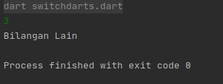

### Percabangan (Conditional Statement)

---

percabangan adalah salah satu cara menentukan kondisi pada suatu program, pada bahasa program dart ini
ada 2 syntax yaitu

* if else
* switch

### Penggunaan If Else

karena bahasa pemrograman dart contoh ini `if Else` dart mirip dengan bahasa penrograman `C`

```dart
import 'dart:io';

main(List<String> args) {
  String? input = stdin.readLineSync();
  var number = int.tryParse(input!);

  if (number! > 0) {
    print('bilangan positif');
  } else if (number < 0) {
    print('bilangan negatif');
  } else {
    print('bilangan 0');
  }
}
``` 

#### Penjelasan Program

pada contoh program diatas kita menentukan nomor jika `>` `0` bilangan positif jika `< 0` maka bilangan negatif
jika `0` maka bilangan tersebut dicetak `0`

### Assign Variabel

contoh penggunaan assign variabel (*Mengganti nilai Variabel*) berikut penerapanya dalam `if else`

```dart
import 'dart:io';

main(List<String> args) {
  String? input = stdin.readLineSync();
  int? number = int.tryParse(input!);

  String output;

  if (number! > 0) {
    output = 'positif';
  } else if (number < 0) {
    output = 'bilangan negatif';
  } else {
    output = 'bilangan 0';
  }

//  cetak kondisi
  print(output);
}

```

### Penyingkatan

kita dapat menyingkat kondisi seperti ini

* `?` untuk if
* `:` else

penggunanya seperti ini

```dart
import 'dart:io';

main(List<String> args) {
  String? input = stdin.readLineSync();
  int? number = int.tryParse(input!);

  String output;

  // penyingkatan
  output = (number! > 0) ? 'postitif' : 'negatif';

//  cetak kondisi
  print(output);
}
```

kita dapat lihat dan fokus disini

```dart
 output = (number! > 0) ? 'postitif' : 'negatif';
```

cara bacanya sama seperti code assign variabel biasa

### Alternative lain

kita bisa langsung print seperti ini

```dart
print((number! > 0) ? 'postitif' : 'negatif');
```
hasilnya sama aja

### Switch Case

kondisional seperti ini syaratnya nilainya tetap contoh seperti ini


```dart
import 'dart:io';

main(List<String> args) {
  String? input = stdin.readLineSync();
  int? number = int.tryParse(input!);

  switch (number) {
    case 0:
      print('bilangan 0');
      break;
    case 1:
      print('bilangan 1');
      break;
    default:
      print('Bilangan Lain');
  }
}
```
* `break` digunakan untuk ketika kodisi terpenuhi maka program akan terpenuhi
* `default` digunakan ketika kodisi dari `switch` tidak sesuai case contoh output



---

[aplikasi pertama](../aplikasi_pertama/README.md) <> [percabangan]() *Chapter ini*